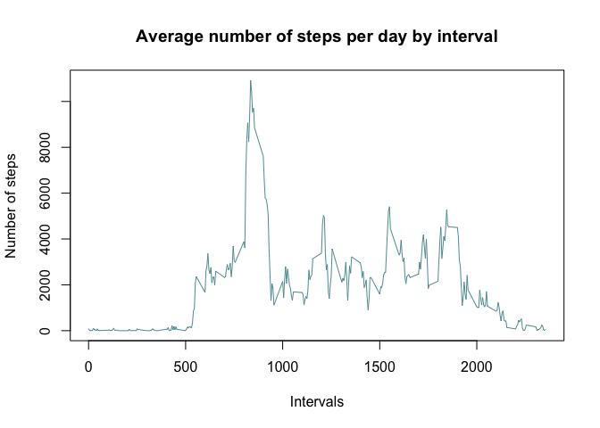
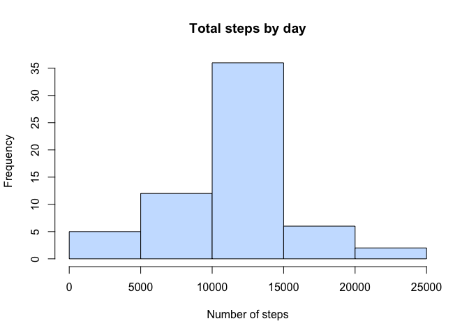
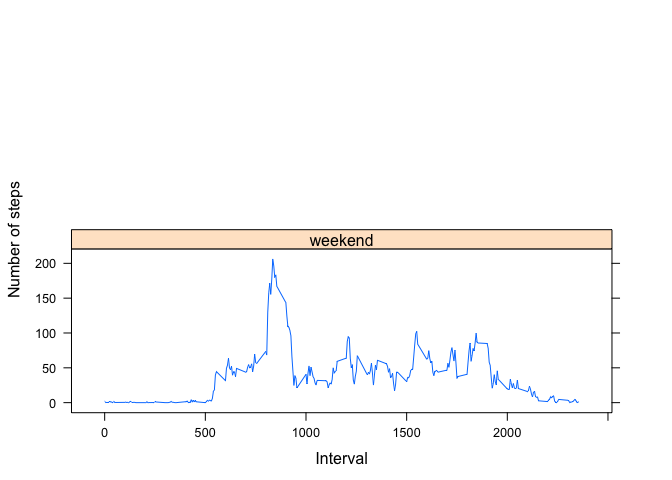

# Reproducible Research: Peer Assessment 1

### Introduction

This is the first project of the **Reproducible Research** course in the Coursera Data Science Specialization track. The assignment makes use of data from personal activity monitoring devices. 

### Data

The data consists of two months of data from an anonymous individual collected during the months of October and November, 2012 and include the number of steps taken in 5 minute invervals each day. 

The data for this assignment were downloaded from the course website:

- **Dataset:** [Activity monitoring data](https://d396qusza40orc.cloudfront.net/repdata%2Fdata%2Factivity.zip) [52K]

The variables included in the dataset are:

- **steps:** Number of steps taking in a 5-minute interval (missing values are coded as `NA`)
- **date:** The date on which the measurement was taken in YYYY-MM-DD format
- **interval:** Identifier for the 5-minute interval in which measurement was taken

The dataset is stored in a comma-separated-value (CSV) file and there are a total of 17,568 observations in this dataset.

## Assignment

The assignment answers the following questions:

## Loading and preprocessing the data

Download, unzip load data into a data frame `activity_data`.


```r
if(!file.exists("getdata-projectfiles-UCI HAR Dataset.zip")) {
        temp <- tempfile()
        download.file("http://d396qusza40orc.cloudfront.net/repdata%2Fdata%2Factivity.zip",temp)
        unzip(temp)
        unlink(temp)
}

activity_data <- read.csv("activity.csv")

head(activity_data)
```

```
##   steps       date interval
## 1    NA 2012-10-01        0
## 2    NA 2012-10-01        5
## 3    NA 2012-10-01       10
## 4    NA 2012-10-01       15
## 5    NA 2012-10-01       20
## 6    NA 2012-10-01       25
```

## What is mean total number of steps taken per day?

First the steps by day need to be summed up: 

```r
aggregate_steps <- aggregate(steps ~ date, activity_data, sum)
head(aggregate_steps)
```

```
##         date steps
## 1 2012-10-02   126
## 2 2012-10-03 11352
## 3 2012-10-04 12116
## 4 2012-10-05 13294
## 5 2012-10-06 15420
## 6 2012-10-07 11015
```

The histogram shows that a daily step count between 10,000 and 15,000 steps was quite frequent:

```r
hist(aggregate_steps$steps, main = "Total steps by day", xlab = "Number of steps", col = "cadetblue")
```

 


```r
summary(aggregate_steps)
```

```
##          date        steps      
##  2012-10-02: 1   Min.   :   41  
##  2012-10-03: 1   1st Qu.: 8841  
##  2012-10-04: 1   Median :10765  
##  2012-10-05: 1   Mean   :10766  
##  2012-10-06: 1   3rd Qu.:13294  
##  2012-10-07: 1   Max.   :21194  
##  (Other)   :47
```

The **mean** total number of steps is `10,766`, the **median** total number of steps is `10,765`. 

## What is the average daily activity pattern?

Steps need to be summed up per day by interval:

```r
aggregate_interval <- aggregate(steps ~ interval, activity_data, sum)
head(aggregate_interval)
```

```
##   interval steps
## 1        0    91
## 2        5    18
## 3       10     7
## 4       15     8
## 5       20     4
## 6       25   111
```

The series plot suggests that the maximum value is around the 800th interval:

```r
library(ggplot2)
ggplot(aggregate_interval, aes(x=interval, y=steps)) + 
        geom_line(color = "cadetblue") +
        xlab("Intervals") +
        ylab("Number of steps") +
        ggtitle("Average number of steps per day by interval") 
```

 


```r
aggregate_interval[which.max(aggregate_interval$steps),1] 
```

```
## [1] 835
```

The 5 minute interval, on average across all the days in the dataset, that contains the maximum number of steps taken is `835`.

## Imputing missing values

There are a number of days/intervals where there are missing values (coded as `NA`). The presence of missing days may introduce bias into some calculations or summaries of the data.

This calculates the total number of mising values in the dataset:

```r
for (Var in names(activity_data)) {
        missing <- sum(is.na(activity_data[,Var]))
        if (missing > 0) {
                print(c(Var,missing))
        }
} 
```

```
## [1] "steps" "2304"
```

The total number of missing values in the dataset is `2304`.

Imputing missing values with mean for 5 minute interval:

```r
## Remove NAs and prepare the new dataframe:
newData <- data.frame(activity_data$steps)
newData[is.na(newData),] <- ceiling(tapply(X=activity_data$step, INDEX=activity_data$interval,FUN=mean,na.rm=TRUE))

activity_clean <- cbind(newData, activity_data[,2:3])
colnames(activity_clean) <- c("steps", "date", "interval")

## Calculate the new number of steps per day. 
new_steps_aggregate <- aggregate(steps ~ date, activity_clean, sum)
head(new_steps_aggregate)
```

```
##         date steps
## 1 2012-10-01 10909
## 2 2012-10-02   126
## 3 2012-10-03 11352
## 4 2012-10-04 12116
## 5 2012-10-05 13294
## 6 2012-10-06 15420
```

A new histogram based on the above new dataset looks as follows:

```r
hist(new_steps_aggregate$steps, main = "Total steps by day", xlab = "Number of steps", col = "lightsteelblue1")
```

 


```r
summary(new_steps_aggregate)
```

```
##          date        steps      
##  2012-10-01: 1   Min.   :   41  
##  2012-10-02: 1   1st Qu.: 9819  
##  2012-10-03: 1   Median :10909  
##  2012-10-04: 1   Mean   :10785  
##  2012-10-05: 1   3rd Qu.:12811  
##  2012-10-06: 1   Max.   :21194  
##  (Other)   :55
```

The new **mean** total number of steps is `10,785`, the **median** total number of steps is `10,909`. 

It seems that adding the missing values to the original data has caused both the mean and median values to increase.

- **mean:** 10766 to 10785
- **median:** 10765 to 10909

## Are there differences in activity patterns between weekdays and weekends?

This creates a new factor variable in the dataset that with two levels - "weekday" and "weekend": 

```r
## Add a column with "weekday" and "weekend".
dateDayType <- data.frame(sapply(X = activity_clean$date, FUN = function(day) {
        if (weekdays(as.Date(day)) %in% c("Montag", "Dienstag", "Mittwoch", "Donnerstag", "Freitag")) {
                                day <- "weekday" } 
        else {
            day <- "weekend" }
}))

NewDataWithDayType <- cbind(activity_clean, dateDayType)

## Need to rename the last column in the file:
names(NewDataWithDayType)[names(NewDataWithDayType)=="sapply.X...activity_clean.date..FUN...function.day..."] <- "day"

## Calculate the aggregate number for intervals for weedays and weekends: 
aggregateStepsDaytype <- aggregate(data=NewDataWithDayType, steps ~ interval + day,FUN=mean)

head(aggregateStepsDaytype)
```

```
##   interval     day     steps
## 1        0 weekday 2.2888889
## 2        5 weekday 0.5333333
## 3       10 weekday 0.2888889
## 4       15 weekday 0.3111111
## 5       20 weekday 0.2222222
## 6       25 weekday 1.7111111
```

The panel plot shows the differences between weekdays and weekends:

```r
library(lattice)
xyplot(steps ~ interval | day, aggregateStepsDaytype, type = "l", layout = c(1, 2), 
    xlab = "Interval", ylab = "Number of steps")
```

 
