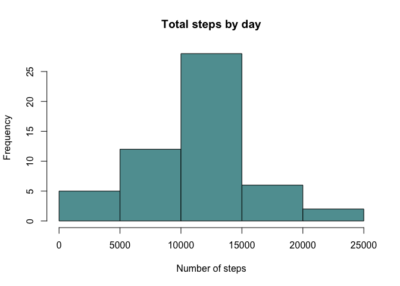

# Reproducible Research: Peer Assessment 1

### Introduction

This is the first project of the **Reproducible Research** course in the Coursera Data Science Specialization track. The assignment makes use of data from personal activity monitoring devices. 

### Data

The data consists of two months of data from an anonymous individual collected during the months of October and November, 2012 and include the number of steps taken in 5 minute invervals each day. 

The data for this assignment were downloaded from the course website:

- **Dataset:** [Activity monitoring data](https://d396qusza40orc.cloudfront.net/repdata%2Fdata%2Factivity.zip) [52K]

The variables included in the dataset are:

- **steps:** Number of steps taking in a 5-minute interval (missing values are coded as `NA`)
- **date:** The date on which the measurement was taken in YYYY-MM-DD format
- **interval:** Identifier for the 5-minute interval in which measurement was taken

The dataset is stored in a comma-separated-value (CSV) file and there are a total of 17,568 observations in this dataset.

## Assignment

The assignment answers the following questions:

## Loading and preprocessing the data

Download, unzip load data into a data frame `activity_data`.


```r
if(!file.exists("getdata-projectfiles-UCI HAR Dataset.zip")) {
        temp <- tempfile()
        download.file("http://d396qusza40orc.cloudfront.net/repdata%2Fdata%2Factivity.zip",temp)
        unzip(temp)
        unlink(temp)
}

activity_data <- read.csv("activity.csv")

head(activity_data)
```

```
##   steps       date interval
## 1    NA 2012-10-01        0
## 2    NA 2012-10-01        5
## 3    NA 2012-10-01       10
## 4    NA 2012-10-01       15
## 5    NA 2012-10-01       20
## 6    NA 2012-10-01       25
```

## What is mean total number of steps taken per day?

First the steps by day need to be summed up: 

```r
aggregate_steps <- aggregate(steps ~ date, activity_data, sum)
head(aggregate_steps)
```

```
##         date steps
## 1 2012-10-02   126
## 2 2012-10-03 11352
## 3 2012-10-04 12116
## 4 2012-10-05 13294
## 5 2012-10-06 15420
## 6 2012-10-07 11015
```

The histogram shows that a daily step count between 10.000 and 15.000 steps was quite frequent:

```r
hist(aggregate_steps$steps, main = "Total steps by day", xlab = "Number of steps", col = "cadetblue")
```

 


```r
summary(aggregate_steps$steps)
```

```
##    Min. 1st Qu.  Median    Mean 3rd Qu.    Max. 
##      41    8841   10760   10770   13290   21190
```

The **mean** total number of steps is `10.770`, the **median** total number of steps is `10.760`. 

## What is the average daily activity pattern?


## Imputing missing values


## Are there differences in activity patterns between weekdays and weekends?
